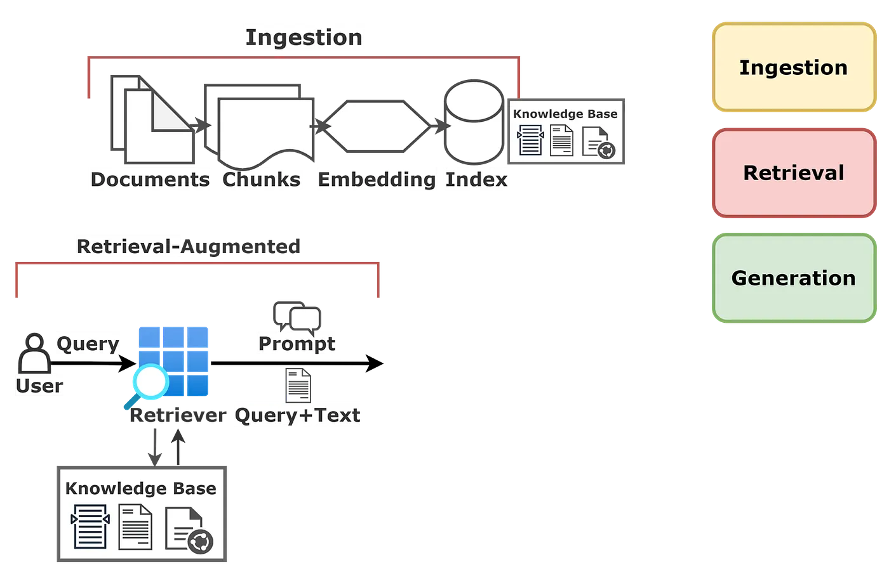

# ibrolive-TT openai demo

To access the app, follow the deployment steps [here](./api/azure-search-openai-javascript/README.md). Then access the app using the generated URL.

---

## Architecture Diagram

expand/collapse

Below is the architectural diagram of this project:

Below is a summary of how Retreival Augmented Generation (RAG) generally works:

Below is a diagram of how ingestion generally works in RAG:

---

## Architecture Design Records (ADR)

expand/collapse

### ADR-001: Azure Web Apps for Application Hosting

**Context:**  
The application requires a scalable, managed hosting solution that supports modern web applications with minimal operational overhead.

**Decision:**  
Use Azure Web Apps (App Service) for hosting the application instead of VMs or container-based solutions.

**Rationale:**
- **Managed Infrastructure:** Eliminates need for OS patching, infrastructure management, and manual scaling configurations
- **Built-in CI/CD:** Native integration with Azure DevOps and GitHub Actions for automated deployments
- **Auto-scaling:** Horizontal and vertical scaling capabilities to handle variable workloads
- **Cost Efficiency:** Pay-per-use pricing model with various tiers to match different workload requirements
- **Security:** Built-in SSL/TLS support, managed certificates, and integration with Azure AD for authentication
- **Developer Productivity:** Simplified deployment process, staging slots for blue-green deployments, and comprehensive monitoring

**Consequences:**
- **Positive:** Reduced operational complexity, faster time-to-market, built-in monitoring and diagnostics
- **Negative:** Less control over underlying infrastructure, potential vendor lock-in, limited customization compared to VMs

**Alternatives Considered:**
- Azure Container Instances/AKS: More complex for simple web applications
- Azure VMs: Higher operational overhead and management burden
- Azure Static Web Apps: Limited to static content and serverless functions

---

### ADR-002: Azure Blob Storage for Document Ingestion

**Context:**  
The application needs to ingest, store, and process various document types for AI-powered search and retrieval. The solution must handle large volumes of documents efficiently and integrate seamlessly with Azure AI Search.

**Decision:**  
Use Azure Blob Storage as the primary data source for document ingestion and storage.

**Rationale:**
- **Scalability:** Handles petabytes of unstructured data with automatic scaling
- **Cost-Effective:** Tiered storage options (Hot, Cool, Archive) to optimize costs based on access patterns
- **Native Integration:** Direct integration with Azure AI Search indexers for automated content extraction
- **Durability:** 99.999999999% (11 9's) durability through geo-redundant storage options
- **Security:** Encryption at rest, role-based access control (RBAC), and private endpoint support
- **Versioning & Lifecycle:** Built-in versioning and lifecycle management policies for data governance

**Consequences:**
- **Positive:** Simplified document management, automatic indexing pipelines, reliable storage with high availability
- **Negative:** Additional service dependency, potential latency for cold/archive tier access

**Alternatives Considered:**
- Azure Data Lake Storage Gen2: Overkill for document storage needs
- Azure Files: Limited AI Search integration capabilities
- Cosmos DB: Higher cost for document storage, designed for operational data

---

### ADR-003: Azure Key Vault for Secret Management

**Context:**  
The application requires secure storage and management of sensitive configuration data including API keys, connection strings, and certificates. Security best practices mandate that secrets should never be stored in code repositories or configuration files.

**Decision:**  
Use Azure Key Vault for centralized secret management across all application components.

**Rationale:**
- **Security:** Hardware Security Module (HSM) backed secret storage with FIPS 140-2 Level 2 compliance
- **Centralized Management:** Single source of truth for all secrets, reducing secret sprawl
- **Access Control:** Fine-grained RBAC and access policies with Azure AD integration
- **Audit Logging:** Complete audit trail of secret access and modifications via Azure Monitor
- **Rotation Support:** Automated secret rotation capabilities to enforce security policies
- **Native Integration:** Seamless integration with Azure services (App Service, Functions, AKS)
- **Secret Versioning:** Maintains version history for rollback and compliance requirements

**Consequences:**
- **Positive:** Enhanced security posture, compliance with security standards, simplified secret rotation
- **Negative:** Additional service cost, potential latency on secret retrieval, requires network connectivity to Azure

**Alternatives Considered:**
- Environment Variables: Insecure, difficult to rotate, no audit trail
- Azure App Configuration: Designed for application settings, not optimized for sensitive secrets
- HashiCorp Vault: Additional infrastructure to manage, higher operational complexity

---

### ADR-004: Azure OpenAI Service for AI-Powered Capabilities

**Context:**  
The application requires advanced natural language processing capabilities including semantic search, content generation, question answering, and conversational AI. The solution must provide enterprise-grade reliability, security, and compliance while leveraging state-of-the-art language models.

**Decision:**  
Use Azure OpenAI Service as the primary AI platform for language understanding and generation tasks.

**Rationale:**
- **Enterprise-Grade Security:** Data remains within Azure tenant, not used for model training, complies with Azure security and compliance standards
- **Latest Models:** Access to GPT-4, GPT-3.5-Turbo, and other OpenAI models with regular updates and improvements
- **Azure Integration:** Native integration with Azure services (Key Vault, Monitor, Private Link, Managed Identity)
- **Content Filtering:** Built-in content moderation and safety filters to prevent harmful outputs
- **SLA Guarantees:** Enterprise SLAs with 99.9% uptime guarantee and Azure support
- **Regional Deployment:** Data residency control with multiple Azure regions available
- **Cost Management:** Token-based pricing with quota management and rate limiting capabilities
- **Compliance:** Meets regulatory requirements including GDPR, HIPAA, SOC 2, and ISO 27001

**Consequences:**
- **Positive:** Enterprise security and compliance, predictable costs, seamless Azure integration, no data exposure to public OpenAI
- **Negative:** Regional availability limitations, requires Azure approval process, slightly higher cost than public OpenAI API, potential rate limits

**Alternatives Considered:**
- OpenAI Public API: Data security concerns, no private endpoints, data used for training, limited enterprise controls
- Self-hosted Open Source Models (LLaMA, Mistral): High infrastructure costs, complex deployment, lower quality responses, significant maintenance overhead
- Amazon Bedrock: Cross-cloud complexity, no Azure ecosystem integration
- Google Vertex AI: Similar limitations to Bedrock, additional cloud vendor management

**Implementation Notes:**
- Deploy using GPT-4 for complex reasoning and analysis tasks
- Use GPT-3.5-Turbo for high-volume, latency-sensitive operations
- Implement exponential backoff retry logic for transient failures
- Configure content filters based on application risk profile
- Monitor token usage and implement cost alerts

---

### ADR-005: Managed Identity for Service Authentication

**Context:**  
The application requires secure authentication between Azure services (App Service, Storage, Key Vault, Azure OpenAI, AI Search) without storing credentials in code or configuration. Traditional approaches using connection strings and access keys pose significant security risks including credential exposure, manual rotation complexity, and audit trail gaps.

**Decision:**  
Use Azure Managed Identity for all service-to-service authentication instead of connection strings, access keys, or service principals with secrets.

**Rationale:**
- **Zero Credential Management:** Eliminates need to store, rotate, or manage credentials in application code or configuration
- **Automatic Lifecycle Management:** Azure automatically handles credential creation, rotation, and expiration
- **Enhanced Security:** Credentials never exposed to code, configuration files, or deployment pipelines
- **Least Privilege Access:** Fine-grained RBAC assignments per service with specific role scopes
- **Comprehensive Auditing:** All authentication attempts logged in Azure Monitor for security analysis
- **Cost-Effective:** No additional cost for using Managed Identity
- **Simplified Operations:** Reduces operational overhead of secret rotation and distribution
- **Compliance:** Meets security compliance requirements by eliminating static credentials

**Consequences:**
- **Positive:** Improved security posture, reduced credential sprawl, simplified deployment, zero-trust architecture alignment
- **Negative:** Requires Azure environment (not portable to other clouds), initial setup complexity for RBAC configuration, limited support in some third-party services

**Alternatives Considered:**
- Service Principals with Secrets: Requires manual secret rotation, secrets must be stored securely (Key Vault), higher operational burden
- Connection Strings/Access Keys: Highly insecure, difficult to rotate, no granular permissions, compliance violations
- Certificate-based Authentication: Complex certificate lifecycle management, still requires secure storage

**Implementation Details:**
- **System-Assigned Managed Identity:** Used for App Service to prevent identity sharing across environments
- **RBAC Assignments:**
  - Storage Blob Data Contributor: Access to Blob Storage for document ingestion
  - Key Vault Secrets User: Read secrets from Key Vault
  - Cognitive Services OpenAI User: Access to Azure OpenAI endpoints
  - Search Index Data Contributor: Read/write access to AI Search indexes
- **Connection Configuration:** Use DefaultAzureCredential in application code for automatic identity resolution
- **Local Development:** Fallback to Azure CLI or Visual Studio credentials for developer authentication

**Migration Path:**
1. Enable System-Assigned Managed Identity on App Service
2. Assign required RBAC roles to the Managed Identity
3. Update application code to use DefaultAzureCredential
4. Test connectivity to all dependent services
5. Remove connection strings and access keys from configuration
6. Revoke old access keys and rotate remaining secrets

---

## Improvements

expand/collapse

### Security Enhancements
- [ ] Implement Azure Front Door with WAF for DDoS protection and threat mitigation
- [ ] Enable Azure Private Link for all services to eliminate public internet exposure
- [ ] Implement Managed Identity across all services to eliminate credential-based authentication
- [ ] Add Azure Policy compliance checks for security baseline enforcement
- [ ] Enable Microsoft Defender for Cloud for advanced threat protection

### Performance Optimizations
- [ ] Implement CDN caching strategy for static assets (Azure CDN or Front Door)
- [ ] Add Redis Cache layer for frequently accessed data and search results
- [ ] Optimize AI Search indexing with incremental updates instead of full rebuilds
- [ ] Implement query result caching to reduce AI Search latency
- [ ] Add Application Insights Smart Detection for proactive performance monitoring

### AI/ML Model Capabilities
- [ ] Implement multi-model support for different use cases (GPT-4 for complex queries, GPT-3.5 for simple ones)
- [ ] Add intelligent model routing based on query complexity and cost optimization
- [ ] Support for multiple AI model providers (Azure OpenAI, OpenAI, Anthropic, local models)
- [ ] Implement A/B testing framework to compare model performance
- [ ] Add fallback mechanisms for model availability and rate limiting
- [ ] Support fine-tuned models for domain-specific use cases
- [ ] Implement model versioning and gradual rollout capabilities
- [ ] Add embedding model options for semantic search (Ada, custom embeddings)
- [ ] Create model performance monitoring and quality metrics dashboard
- [ ] Implement dynamic model selection based on user preferences and SLA requirements

### Scalability Improvements
- [ ] Configure auto-scaling rules based on CPU, memory, and request metrics
- [ ] Implement queue-based load leveling for document processing (Azure Service Bus/Storage Queue)
- [ ] Add Azure API Management for rate limiting and throttling protection
- [ ] Design for multi-region deployment with Azure Traffic Manager
- [ ] Implement database connection pooling and optimization

### Multi-Tenancy & Isolation
- [ ] Implement tenant isolation with dedicated storage containers per tenant
- [ ] Add tenant-specific AI Search indexes for data segregation
- [ ] Implement tenant context propagation across all services
- [ ] Add tenant-based authentication and authorization using Azure AD B2C
- [ ] Create tenant management portal for provisioning and configuration
- [ ] Implement resource quotas and usage limits per tenant
- [ ] Add tenant-level billing and cost tracking
- [ ] Implement data residency controls for regional compliance requirements
- [ ] Add tenant-specific customization (branding, themes, configurations)
- [ ] Create tenant isolation testing and validation framework

### DevOps & Monitoring
- [ ] Enhance CI/CD pipeline with automated testing (unit, integration, e2e)
- [ ] Implement blue-green deployment strategy using staging slots
- [ ] Add comprehensive Application Insights instrumentation and custom metrics
- [ ] Set up Azure Monitor alerts for key performance and availability metrics
- [ ] Implement automated rollback mechanisms on deployment failure
- [ ] Add infrastructure-as-code validation with Azure Policy as Code

### Cost Optimization
- [ ] Implement Azure Cost Management budgets and alerts
- [ ] Review and rightsize App Service plans based on actual usage
- [ ] Enable auto-pause for development/test environments
- [ ] Implement Blob Storage lifecycle policies to move cold data to archive tier
- [ ] Consider Azure Reserved Instances for predictable workloads

### Data Ingestion & Integration
- [ ] Add support for additional data sources beyond Blob Storage (Azure Data Lake, SharePoint, OneDrive)
- [ ] Implement incremental indexing to process only new/modified documents
- [ ] Add support for structured data sources (Azure SQL, Cosmos DB)
- [ ] Integrate with third-party document management systems (Box, Dropbox, Google Drive)
- [ ] Add API endpoints for programmatic document submission
- [ ] Support for real-time data streaming from Event Hubs or IoT Hub
- [ ] Implement webhook-based ingestion for external system notifications

### User Experience
- [ ] Add real-time status updates for long-running document processing operations
- [ ] Implement progressive loading for search results
- [ ] Add support for document preview without full download
- [ ] Enhance error messages with actionable guidance
- [ ] Implement user feedback mechanism for search relevance improvement
- [ ] Create seamless customer onboarding experience with guided tours and interactive tutorials
- [ ] Add contextual help and tooltips throughout the application
- [ ] Implement quick-start templates for common use cases
- [ ] Provide sample documents and pre-configured search queries for new users
- [ ] Add video tutorials and documentation for key features

### Compliance & Governance
- [ ] Implement data retention policies aligned with organizational requirements
- [ ] Add comprehensive audit logging for all data access operations
- [ ] Implement data classification and tagging strategy
- [ ] Add GDPR compliance features (data export, right to be forgotten)
- [ ] Create disaster recovery and business continuity plan with documented RPO/RTO

---

## Task List

expand/collapse

[See status of tasks in this project](./TODO.md)

